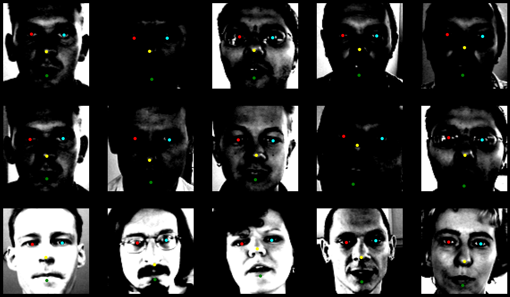
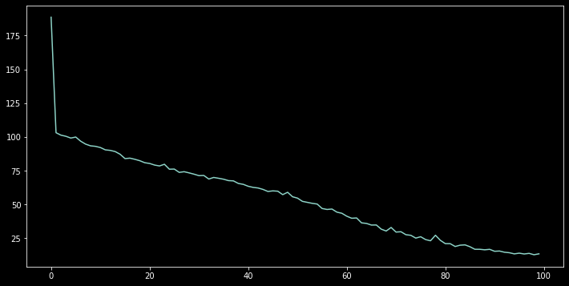
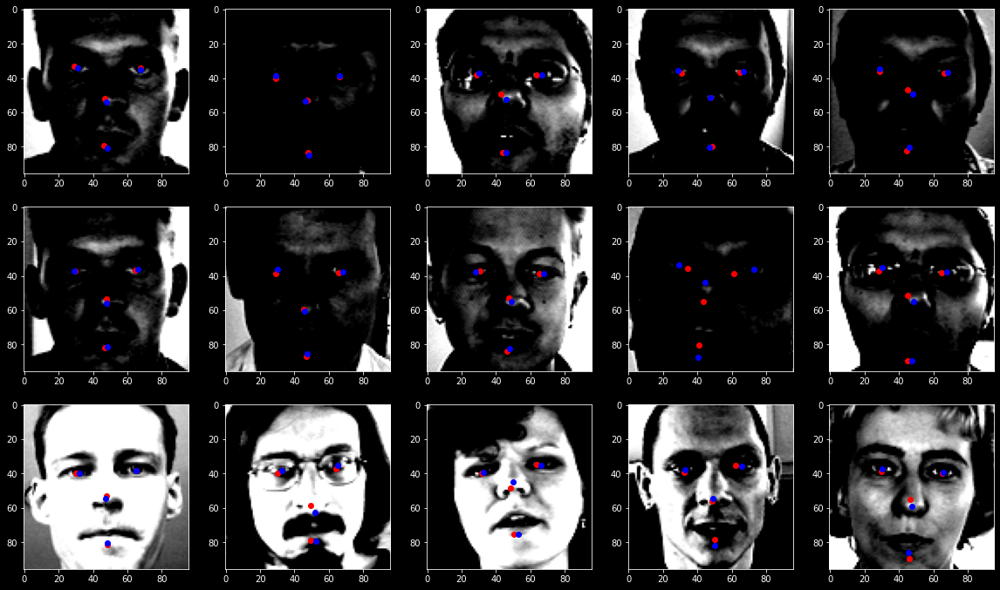

# Facial keypoints detection

**Facial keypoints detection on the 4 major part of the face**

- Left eye
- Right eye
- Nose tip
- Mouth ( bottom lips center )

**Dataset link : https://www.kaggle.com/c/facial-keypoints-detection/data**

This dataset is completely loaded and trained on pytorch pretrained RES-NET 50 on imagenet ( Didnt freeze any layers ).
This took around 22h to complete 100 epochs to get the MSE of 13.

### Loss history

### Predicted and Actual keypoints

- Red points : Predicted keypoints
- Blue Points : Actual keypoints

### conclusion

- Model was highly overfitting to this current dataset due to the less number of training images
- Some of the images had 2 faces standing from afar
- Duplicated images within the training images
